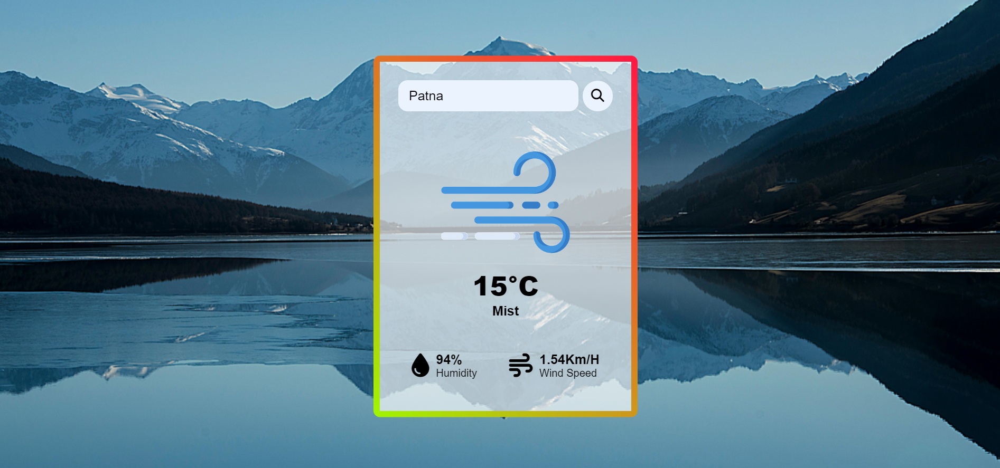

# Weather App

This Weather App is a simple web application that allows users to check the current weather conditions of a specific location. Users can enter the location in the search box, and the app will fetch and display real-time weather information.

## Features

- **Search Weather:** Enter a location in the search box and click the search button to check the current weather.
- **Weather Information:** Displays temperature, weather description, humidity, and wind speed.
- **Weather Images:** Shows corresponding weather images based on the current weather conditions.

## File Structure

- [`index.html`](index.html): HTML file containing the structure of the Weather App.
- [`style.css`](style.css): CSS file for styling the Weather App.
- [`script.js`](script.js): JavaScript file for handling user interactions and fetching weather data.
- [`assets/`](assets/): Directory containing weather images and error image.
- [`README.md`](README.md): Project documentation.

## Getting Started

1. Clone the repository:

    ```bash
    git clone https://github.com/ashishkr375/weather.git
    ```

2. Open `index.html` in a web browser.

3. Enter a location in the search box and click the search button to check the weather.

## Dependencies

- [Font Awesome](https://fontawesome.com/) (linked via CDN): Used for weather icons.

## How It Works

1. Enter a location in the search box.
2. Click the search button.
3. The app fetches weather data using the OpenWeatherMap API.
4. Displays weather information and corresponding weather images.
5. If the location is not found, a 404 error image is displayed.

## Contributing

Feel free to contribute to the project by opening issues, providing feedback, or submitting pull requests to enhance the Weather App.

## License

This project is licensed under the [MIT License](LICENSE).

## Preview


